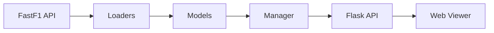

# f1-replay

[](https://badge.fury.io/py/f1-replay)
[](https://www.python.org/downloads/)
[](https://opensource.org/licenses/MIT)

A Python toolkit for Formula 1 data analysis and visualization. Built on [FastF1](https://github.com/theOehrly/Fast-F1) with intelligent caching, schedule tools, circuit plotting, and live race replay.

## Installation

```bash
pip install f1-replay
```

## Features

- **3-Tier Data Management** — Hierarchical caching system for seasons, weekends, and sessions
- **F1 Info Tools** — Query schedules, browse events, and resolve races by name or round
- **Circuit Plotting** — Poster-style track maps with sector coloring and telemetry overlays
- **Race Replay** — Interactive 2D visualization with real-time car positions

---

## Architecture



Data flows through a **3-tier pipeline** with pickle caching at each level:

| Tier | Scope | Cache File | Contents |
|------|-------|------------|----------|
| 1 | Season | `seasons.pkl` | All events per year |
| 2 | Weekend | `Weekend.pkl` | Circuit geometry, pit lane, corners |
| 3 | Session | `Race.pkl` etc. | Telemetry, events, results |

See [docs/ARCHITECTURE.md](docs/ARCHITECTURE.md) for the full deep-dive.

---

## Quick Start

```python
from f1_replay import Manager

manager = Manager()

# Launch interactive race replay
manager.race(2024, "monaco")

# Browse available races
manager.season_schedule(2024)
```

---

## Data Management

Intelligent 3-tier caching system that minimizes API calls and enables fast data access.

### Tier 1: Seasons Catalog

```python
manager.list_years()           # Available seasons
manager.get_season(2024)       # All events for a year
```

### Tier 2: Weekend Data

```python
weekend = manager.load_weekend(2024, "monaco")

weekend.circuit.track          # Track geometry (x, y, z)
weekend.circuit.pit_lane       # Pit lane coordinates
weekend.circuit.corners        # Corner positions and numbers
```

### Tier 3: Session Telemetry

```python
session = manager.load_session(2024, "monaco", "Race")

session.telemetry["VER"]       # Polars DataFrame with full telemetry
session.drivers                # ["VER", "NOR", "LEC", ...]
session.driver_colors          # {"VER": "#3671C6", ...}
session.track_status           # Yellow flags, safety cars, etc.
session.race_control           # Race control messages
```

**Telemetry columns:** `session_time`, `x`, `y`, `z`, `speed`, `throttle`, `brake`, `rpm`, `gear`, `drs`, `lap_number`, `compound`, `tyre_life`, `track_distance`

---

## F1 Info Tools

Query schedules and find events with flexible resolution.

```python
# Schedule queries
manager.season_schedule(2024)      # Full season overview
manager.race_schedule(2024)        # Race sessions only
manager.sprint_schedule(2024)      # Sprint weekends
manager.qualification_schedule(2024)
manager.practice_schedule(2024)

# Flexible event lookup
manager.load_weekend(2024, 8)           # By round number
manager.load_weekend(2024, "monaco")    # By name (case-insensitive)
manager.load_weekend(2024, "abu dhabi") # Partial match supported
```

---

## Circuit Plotting

Generate poster-style circuit maps with customizable visualization.

```python
from f1_replay.tools import plot_weekend

weekend = manager.load_weekend(2024, "monaco")

# Clean white track
plot_weekend(weekend.circuit, weekend.event)

# Colored by marshal sectors
plot_weekend(weekend.circuit, weekend.event, color_mode='sectors')

# Telemetry overlay (requires session data)
plot_weekend(weekend.circuit, weekend.event, color_mode='speed')
```

**Color modes:** `white`, `sectors`, `speed`, `throttle`, `brake`, `height`

---

## Race Replay

Launch an interactive web viewer with real-time car positions.

```python
# Python API
manager.race(2024, "monaco")
manager.race(2024, 8, port=8080)

# With force refresh from FastF1
manager.race(2024, "monaco", force_update=True)
```

```bash
# CLI
f1-replay race 2024 monaco
f1-replay race 2024 8 --port 8080
```

The viewer includes:

- 2D track map with animated car positions and driver colors
- Live standings with position tracking, gap times, and tyre compounds
- Strategy panel with tyre stint bars and pit stop markers
- Lap time chart overlay (top 5 + chased driver)
- Starting lights animation and formation lap
- Track status overlays (safety car, VSC, red flag, sector yellows)
- Rain overlay with particle animation
- Race control message feed
- Chase mode (follow individual driver with auto-zoom)
- Pan/zoom with mouse, session tabs (switch R/Q/FP)
- Qualifying results view with delta to pole
- Data export (CSV/JSON)

### Keyboard Shortcuts

| Key | Action |
|-----|--------|
| `Space` | Play / Pause |
| `Left` / `Right` | Seek 10 seconds |
| `Shift+Left` / `Shift+Right` | Seek 60 seconds |
| `+` / `-` | Increase / Decrease playback speed |
| `C` or `Escape` | Exit chase mode |
| `L` | Toggle lap time chart |
| `S` | Toggle strategy panel |

---

## CLI Reference

```bash
# Race replay
f1-replay race <year> <round|name> [--port PORT]

# Browse seasons
f1-replay seasons [year]

# Standalone API server
f1-replay server [--port PORT]

# Configuration
f1-replay config                          # Show current config
f1-replay config --set-cache-dir /path    # Set cache directory

# Migrate legacy cache files
f1-replay migrate-cache [--dry-run]
```

---

## Configuration

```python
from f1_replay import set_cache_dir, get_cache_dir

set_cache_dir("/path/to/data")    # Persists to ~/.f1replay/config.json
get_cache_dir()                   # Current cache directory
```

```bash
# Environment variable (highest priority)
export F1_REPLAY_CACHE_DIR=/path/to/data
```

**Priority:** Environment variable → Config file → Default (`./race_data`)

---

## Cache Structure

```text
race_data/
├── seasons.pkl
└── 2024/
    └── 08_Monaco/
        ├── Weekend.pkl     # Circuit geometry + metadata
        ├── Race.pkl        # Race telemetry
        ├── Qualifying.pkl  # Qualifying telemetry
        └── ...
```

---

## Development

```bash
git clone https://github.com/your-org/f1-replay.git && cd f1-replay
make install   # pip install -e ".[dev,all]"
make check     # lint + tests (196 tests)
make format    # auto-format code
```

See [CONTRIBUTING.md](CONTRIBUTING.md) for the full development guide and [docs/](docs/index.md) for architecture, API, and telemetry reference.

---

## Requirements

- Python 3.9+
- FastF1, Flask, Polars, NumPy, SciPy, Pandas
- Optional: matplotlib (circuit plots), orjson (faster JSON), flask-cors

## License

MIT
